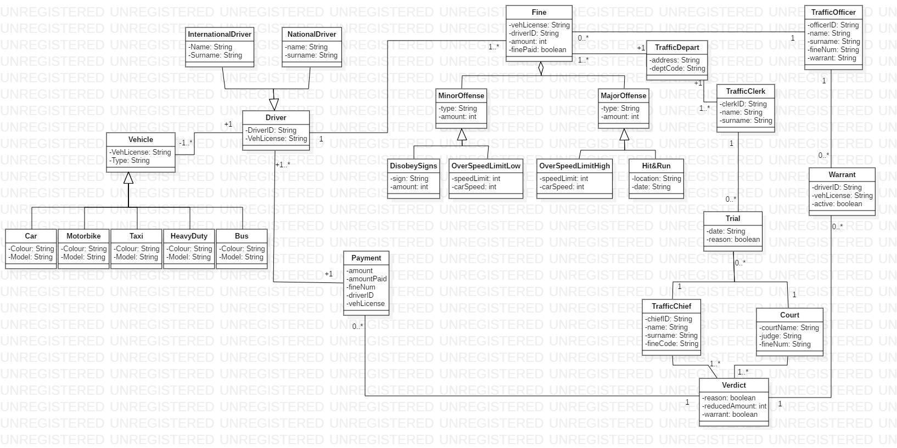

# Traffic Fines Support System
---

Welcome to the new and improved Trafficking system that tries to handle the traffic fines 
coming in and out of traffic departments more effeciently and accurately than ever before.
Problems have risen with regards to too much documentation needing to be done in such 
little time and this system is trying to offer the solution by documenting every fine(ticket)
that is registered on the system. Some fines are not being sent to drivers and the system 
tries to keep track of every fine registered and makes sure that the fine is sent to the 
driver concerned.

## General Flow

Traffic fines(tickets) flow into a traffic department daily. Traffic fines are then seperated 
according to their type which could either be a "Minor violation" or a "Major" violation. This
helps the traffic clerk deduce the payment amount needed or whether it would be a straight
court summons. If the driver wishes for a trial, the paper work is then sent to the 
traffic chief who will then take the matter futher by getting a court verdict. The driver is
then able to have his statement heard and the Judge will then decide whether the payment should
be reduced or a warrant will be issued for the driver's arrest. The warrant is then sent back to
the traffic officers to find the driver.
A driver can either be international or national which means they might not own the car that
they are driving. vehicles are seperated into types (Car, Motorbike, Taxi, HeavyDuty) to make 
things easier with regards to keeping track of the vehicle.

## Getting Started

These are the systems you would need to run the code

- Any IDE preferably IntelliJ IDEA
- junit 4.11
- Maven

## UML Diagram

